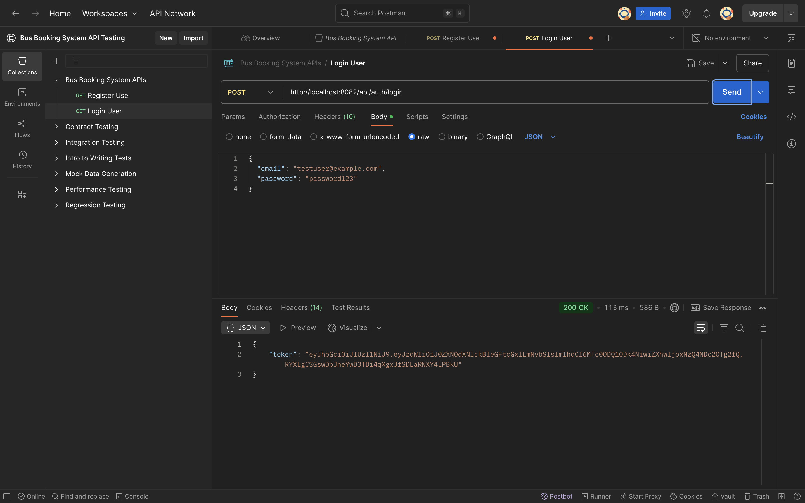
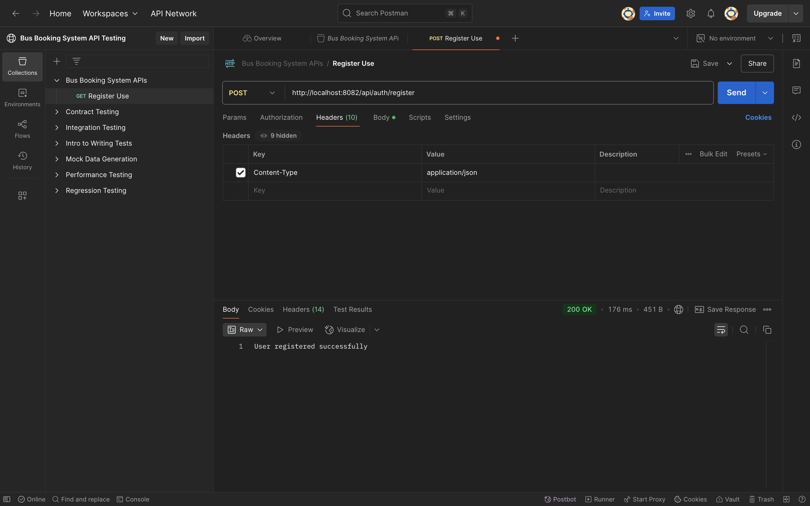
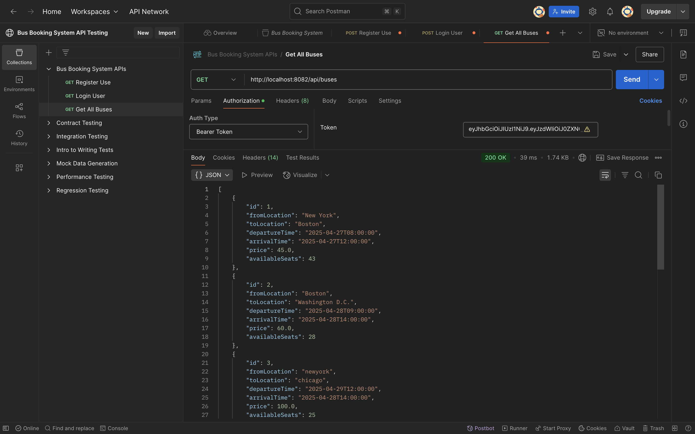
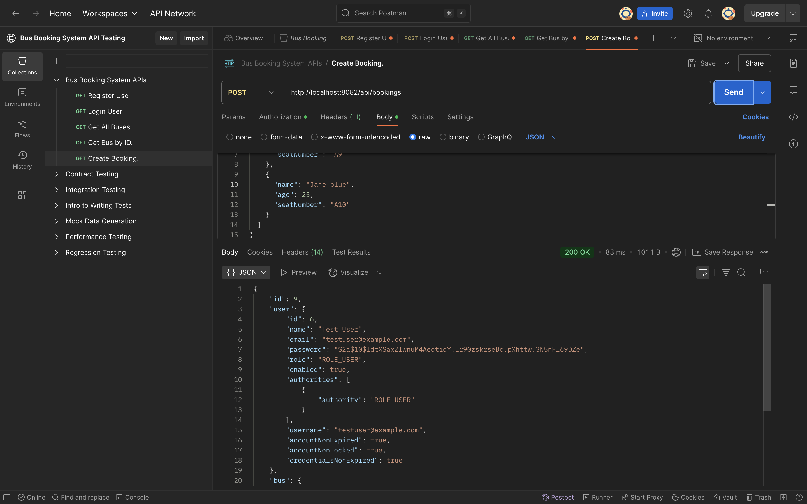

# 🚌 **Bus Booking System**
### **Full-Stack Bus Ticketing Platform (React + Spring Boot + PostgreSQL)**

<p align="center">
  
  
  
  
  
  
</p>

A production-grade bus reservation platform built using **React**, **Spring Boot**, and **PostgreSQL**, deployed on **Render** with modern engineering principles, modular backend architecture, and a clean scalable user interface.

---

# 🌐 **Live Demo**

### 🚀 Frontend (React) — Render Deployment  
👉 **https://bus-booking-system-frontend.onrender.com**

> ⚠ Backend + PostgreSQL remain private for security, rate limiting, and user protection.

---

# 🔍 **Overview**

The **Bus Booking System** provides a complete end-to-end ticket reservation experience:

- 🔐 JWT-secured authentication  
- 🚌 Route-based bus search  
- 🎫 Real-time seat availability tracking  
- 👥 Multi-passenger booking  
- 🧾 Booking history with seat details  
- 📡 Fully deployed with CI-friendly architecture  

Built for **scalability**, **modularity**, and **enterprise-readiness**.

---

# ⭐ **Key Features**

### 👨‍💻 User-Oriented Features
- Secure registration & login  
- Search buses dynamically  
- Real-time seat availability  
- Multi-passenger booking  
- Booking history  

### 🛠 Engineering Features
- Layered backend architecture  
- Robust validation  
- Modular React UI  
- Strong JWT security  
- Clean API design  

---

# 🧠 **Tech Stack**

### **Frontend**
- React 18  
- React Router  
- Axios  
- CSS Modules  

### **Backend**
- Java 17+  
- Spring Boot 3  
- Spring Security (JWT)  
- Spring Data JPA  

### **Database**
- PostgreSQL 15 (Managed on Render)

### **DevOps**
- Render Web Service  
- Render Static Site  
- Render Managed PostgreSQL  
- Dockerfile  

---

# 🏗 **System Architecture**

```
                          ┌────────────────────────────┐
                          │       React Frontend        │
                          │  User Interface + Routing   │
                          └──────────────┬──────────────┘
                                         │ HTTPS (Axios)
                                         ▼
                          ┌────────────────────────────┐
                          │     Spring Boot Backend     │
                          │  API, Auth, Booking Logic   │
                          └──────────────┬──────────────┘
                                         │ JPA Queries
                                         ▼
                          ┌────────────────────────────┐
                          │     PostgreSQL Database     │
                          │ Managed on Render Cloud     │
                          └──────────────────────────────┘
```

---

# 📁 **Project Structure**

```
bus-booking-system/
│
├── frontend/
│   ├── public/
│   └── src/
│       ├── components/
│       ├── pages/
│       ├── api/
│       ├── hooks/
│       └── styles/
│
├── src/ (Spring Boot Backend)
│   ├── main/java/com/busbooking
│   │   ├── controller/
│   │   ├── service/
│   │   ├── repository/
│   │   ├── model/
│   │   └── security/
│   └── main/resources/
│
├── screenshots/
├── Dockerfile
└── README.md
```

---

# 📸 **Screenshots (Collapsible Sections)**  

## <details>
<summary><strong>🖥 UI Screenshots</strong></summary>

### Home Page  


### Login Success  


### Registration Success  


### Bus Search  


### Booking Page  


### Booking Success  


### User Profile  


</details>

---

## <details>
<summary><strong>🔌 API Testing (Postman)</strong></summary>







</details>

---

## <details>
<summary><strong>🗄 Database Screenshots </strong></summary>


</details>

---

# ⚙️ **Installation & Setup**

## 1️⃣ Clone Repo
```bash
git clone https://github.com/TheComputationalCore/bus-booking-system.git
cd bus-booking-system
```

---

# 🖥 Backend Setup

Configure PostgreSQL:

```properties
spring.datasource.url=jdbc:postgresql://HOST:PORT/DATABASE
spring.datasource.username=USER
spring.datasource.password=PASSWORD
spring.jpa.hibernate.ddl-auto=update
spring.jpa.properties.hibernate.dialect=org.hibernate.dialect.PostgreSQLDialect
```

Start backend:
```bash
mvn spring-boot:run
```

---

# 🎨 Frontend Setup

```bash
cd frontend
npm install
npm start
```

Runs at: **http://localhost:3000**

---

# 🔐 Authentication Overview

- JWT stored in `localStorage`  
- Auto-injected into Axios headers  
- Invalid tokens → 401 → redirect login  

---

# 🛣 API Summary

- `POST /api/auth/register`
- `POST /api/auth/login`
- `GET /api/buses`
- `GET /api/buses/{id}`
- `POST /api/bookings`
- `GET /api/bookings/history`

---

# 📏 Validation Rules

### User  
- Email required  
- Password ≥ 6 chars  
- Name ≤ 100 chars  

### Bus  
- Valid times  
- Seats 0–100  
- Locations ≤ 100 chars  

### Booking  
- Unique seat numbers  
- Non-empty passengers  
- Ages 1–120  

---

# 🚀 Deployment (Render)

### Frontend  
- Static Site  
- Build: `npm run build`  
- Publish: `build/`

### Backend  
- Web Service using `Dockerfile`

### Database  
- Render Managed PostgreSQL

---

# 🛣 Roadmap

- Admin Panel  
- Payment Gateway  
- Email Tickets  
- Real-Time Seat Locking  
- RBAC  

---

# 👤 Author

**Dinesh Chandra — TheComputationalCore**  
GitHub: https://github.com/TheComputationalCore  
YouTube: https://www.youtube.com/@TheComputationalCore  

---

# 📄 License

MIT License
